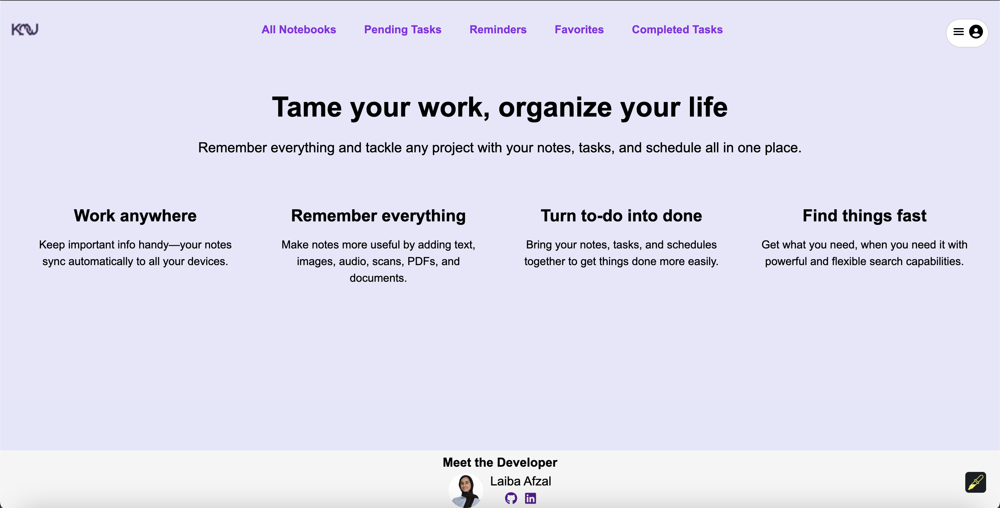
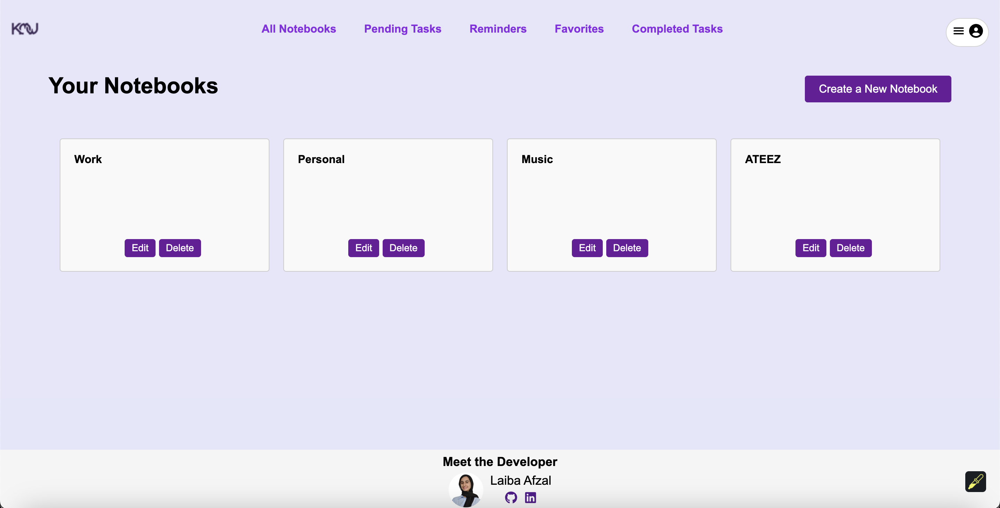
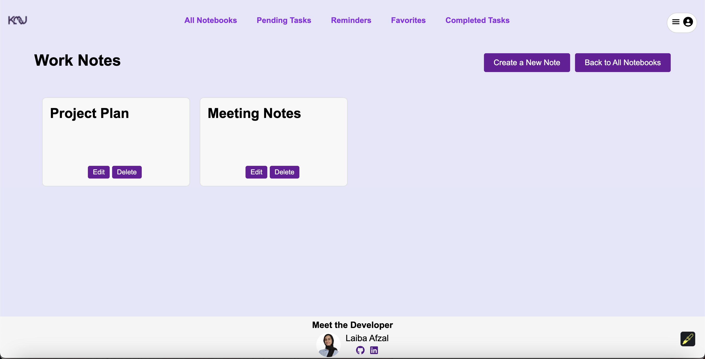
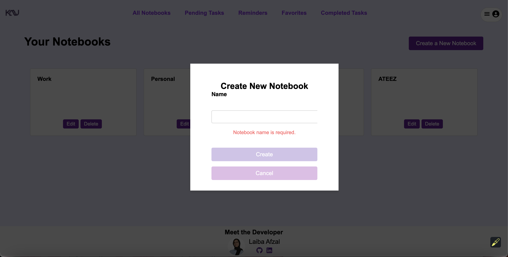
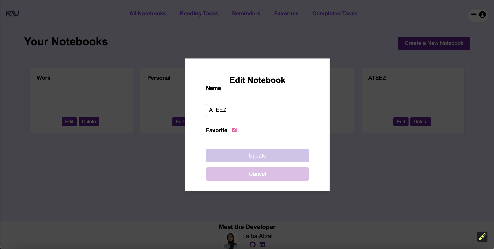
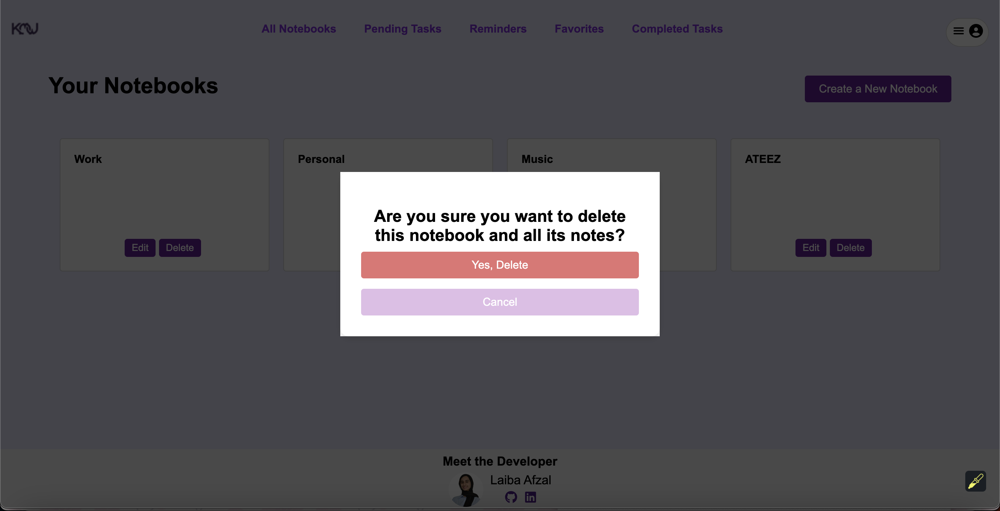
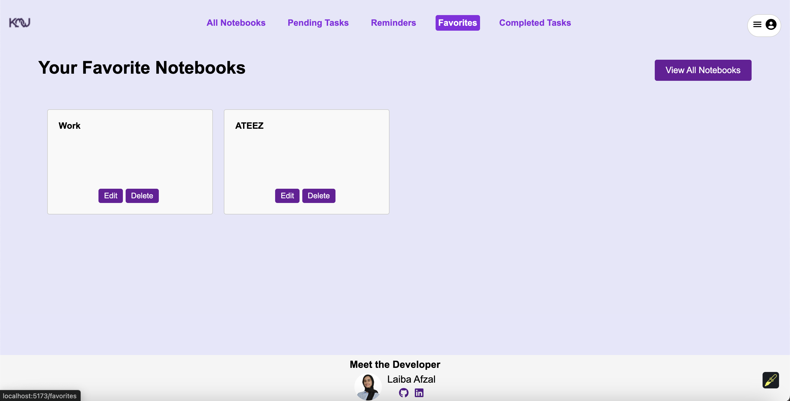

# Capstone Project: KayKewNotes

KayKewNotes is a comprehensive web application designed to help users effectively organize their personal and professional lives by managing their notes, tasks, and reminders all in one place. Inspired by the need for a streamlined, user-friendly digital workspace, Notes combines the best features of popular note-taking and task management apps while providing a clean, intuitive interface. Whether you are a student, professional, or someone looking to manage daily to-dos, KayKewNotes aims to simplify the process of keeping your thoughts and tasks in order. Experience the ease of creating, organizing, and tracking your notes and tasks with KayKewNotes!

Check out the live version of KayKewNotes here: [KayKewNotes](https://aa-capstone-project.onrender.com/)

## Index

* [Wiki](https://github.com/lai-baa/capstone-project/wiki)
  * [Database Schema](https://github.com/lai-baa/capstone-project/wiki/DB-Schema)
  * [API Documentation](https://github.com/lai-baa/capstone-project/wiki/API-Documentation)
  * [User Stories](https://github.com/lai-baa/capstone-project/wiki/User-Stories)
* [Feature List](#feature-list)
* [Technologies](#technologies)
* [Screenshots](#screenshots)

## Feature List

  * ### Implemented Features
    * ### Notebooks
      * **Description**: Users can view, create, edit, and delete their notebooks, allowing for efficient organization of notes under categorized sections.
      * [Screenshots]()
      * Planned Improvements:
        * Ability to search for specific notebooks by title.
      

## Technologies

  1. **React** for building a single-page application and creating reusable components.
  2. **Redux** for centralized state management across the app.
  3. **Node.js** for its non-blocking architecture and easy code modifications.
  4. **Express.js** for building a RESTful API and handling HTTP requests efficiently.
  5. **Sequelize** for interacting with relational databases and managing database models securely.
  6. **PostgreSQL/SQLite** as databases for local development and deployment.
  7. **CSS Grid/Flex** for dynamic and visually organized layouts.

## Screenshots
**Landing Page** 

### Notebooks
**Notebooks List** 

**Notebook Details/Notes List** 

**Create Notebook Modal** 

**Edit Notebook Modal** 

**Delete Notebook Modal** 

**Favorite Notebooks Page** 

### Notes
**Note Details Page** 

**Create Note Modal** 

**Edit Note Modal** 

**Delete Note Modal** 

### Tasks
**Tasks List** 

**Task Details** 

**Create Task Modal** 

**Edit Task Modal** 

**Delete Task Modal** 

**Reminders Page** 

**Completed Tasks Page** 